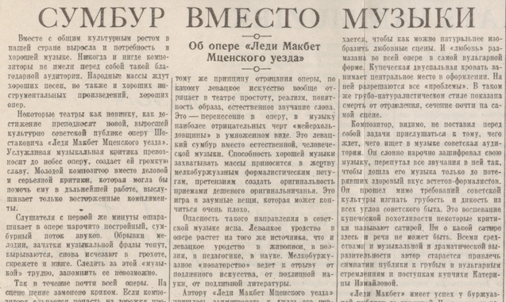

# muddler.py: Xenharmonic Muddle Generator

A Python 3.9+ command-line tool for generating **xenharmonic muddles**: pitch collections derived by recursively nesting MOS (Moment of Symmetry) scales inside one another across arbitrary EDO (Equal Division of the Octave) spaces.

For background on the theory, see the Xen Wiki:
- [Muddle](https://en.xen.wiki/w/Muddle)
- [MOS scale](https://en.xen.wiki/w/MOS_scale)

---

## Concept

This is a script that I've found useful for figuring out harmonic approaches in different xenharmonic EDO (equal division of the octave) spaces. The idea is to begin with a larger MOS formulation over the complete **n₀-EDO** space, picking out **n₁** notes, then finding a smaller MOS within this subspace of size **n₂**, and rinse and repeat to an arbitrarily nested level.

1. Start with a large MOS (or any pitch collection) over an **n₀-EDO** space, selecting **n₁** notes.
2. Treat that MOS as a "retuned" version of **n₁-EDO** space (i.e. use it as the new chromatic universe).
3. Find a smaller MOS of size **n₂** within this subspace.
4. Repeat to arbitrary depth.

Each resulting pitch collection is called a **muddle**. The tool generates all possible muddles by taking every combination of rotations (modes) across the input scales, then groups the results by interval-cycle equivalence (i.e., all modes of a given muddle are collected into the same group).

---

## Requirements

- Python 3.9+
- No third-party dependencies (uses only the standard library)

---

## Usage

```
python3 muddler.py <filename> [options]
python3 muddler.py --filename <filename> [options]
```

### Options

| Flag | Description |
|---|---|
| `<filename>` | Input file path (positional or via `-f` / `--filename`); if `-` is provided, read from stdin |
| `--show-context` | Show how each muddle is derived: lists the chain of modes from each input scale, with rotation and mode ordinal at each level |
| `--initial-index 0\|1` | Whether scale degrees in input/output are 0-indexed or 1-indexed (default: `1`) |
| `--format` | Output format for each muddle (default: `degrees`); see below |
| `--context-format` | Output format used for the context output when `--show-context` is enabled; accepts the same values as `--format`. Defaults to the value of `--format` if not set |

### Output Formats

| Value | Description |
|---|---|
| `intervals` | List of step intervals between consecutive degrees |
| `degrees` | List of EDO scale degrees |
| `degrees_and_intervals` | Both degrees and intervals on one line |
| `sw` | Scale Workshop compatible format (`d\n` per degree, 1-indexed) |

---

## Input File Format

The first line contains an EDO size n₀, and (separated by whitespace) an `input_type` parameter, stating whether the following lines will be specified as lists of scale degrees (`degrees`, `positions`, or `keys`), lists of intervals (`intervals`, `steps`), or lists of binary 0 or 1 values indicating whether the corresponding scale degree is included (`binary`, `onoff`).

Each subsequent line should follow the `input_type`:

- If using the **scale degree format**, each line should consist of a whitespace-delimited list of scale degrees, specified as:
  - integers in `[0, nᵢ - 1]` if 0-indexed or `[1, nᵢ]` if 1-indexed
  - a list of float values each expressed roughly as a fraction over nᵢ
  - a single-line list of Scale Workshop compatible scale data in the form of `d\nᵢ` (1-indexed must be enabled for this)
- If using the **interval format**, each line should consist of a whitespace-delimited list of intervals dᵢ; each dᵢ series should have a sum less than or equal to nᵢ. If the sum is less than nᵢ, the difference will be assumed as a single step back to the first note to complete the octave.
- If using the **binary format**, each line should consist of a whitespace-delimited list of nᵢ binary values 0 or 1, each corresponding to whether nᵢ-EDO degree dᵢ should be included in the current pitch collection.

There is no requirement for each line to be a MOS. Each line can be an arbitrary subset of nᵢ-EDO space.

The number of notes specified for inclusion in each line `i` will be assumed as the size of the EDO space n_{i+1} of the next line. (There is not much validation to ensure this, except in the `binary` case; this is done somewhat deliberately in the case of the **interval** and **scale degree** formats, in order to allow non-octave-reduced input. The output, on the other hand, is always octave reduced.)

### Locking a Scale

Appending the word `locked` (or any unambiguous prefix, e.g. `lock`) to a scale line suppresses rotation: that scale is treated as having only one mode (its root position).

### Comments and Blank Lines

Lines beginning with `#` and empty lines are ignored.

### Input Type Inference

If the `input_type` is not specified in the first line, the muddler attempts to identify the input type on each line using the following heuristic:

1. If every token is `0` or `1` → **binary**
2. Else if the sum of all tokens (after multiplying by the lowest common multiple of the denominators) ≤ nᵢ → **intervals**
3. Otherwise → **degrees**

---

## Output Structure

Results are printed as numbered **groups**. All muddles within a group are modes of one another (i.e. they share the same interval cycle up to rotation). Within each group, each distinct rotation is listed separately, optionally followed by its derivation context.

```
Group N: (<interval cycle>)

[<muddle>]
[Context:]
[ - ]
[    <mode chain>]

--------
```

NOTE: All muddles are sorted in order of their intervals before grouping. As a result, the muddle "groups" are roughly listed from "darkest" to "brightest". The first group is likely to have the smallest intervals near the beginning of the scale, and the most "flats" in the darkest mode (but also the most "sharps" in the brighest mode, and probably also greater interval variety and "hardness"), and the last group is likely to be the closest to an equalized n-EDO scale, the least number of sharps and flats in any mode, and more "softness".

---

## Examples

### Example 1: 12-EDO, degrees format

**`test1.txt`:**
```
12edo degrees
1 3 5 6 8 10 12
1 3 4 5 7
```

Line 1 selects 7 degrees from 12-EDO. Line 2 then selects 5 degrees from that 7-note subspace.

**Run:**
```
python3 muddler.py test1.txt --format=degrees
```

**Output (excerpt):**
```
Group 1: (1, 2, 3, 2, 4)

[1, 2, 4, 7, 9]

[1, 3, 6, 8, 12]

[1, 4, 6, 10, 11]

[1, 3, 7, 8, 10]

[1, 5, 6, 8, 11]

--------

Group 2: (1, 2, 4, 1, 4)

[1, 2, 4, 8, 9]

[1, 3, 7, 8, 12]

[1, 5, 6, 10, 11]

[1, 2, 6, 7, 9]

[1, 5, 6, 8, 12]

--------

Group 3: (1, 4, 1, 4, 2)

[1, 2, 6, 7, 11]

[1, 5, 6, 10, 12]

[1, 2, 6, 8, 9]

[1, 5, 7, 8, 12]

[1, 3, 4, 8, 9]

--------

Group 4: (1, 4, 2, 3, 2)

[1, 2, 6, 8, 11]

[1, 5, 7, 10, 12]

[1, 3, 6, 8, 9]

[1, 4, 6, 7, 11]

[1, 3, 4, 8, 10]

--------

Group 5: (2, 2, 3, 2, 3)

[1, 3, 5, 8, 10]

[1, 3, 6, 8, 11]

[1, 4, 6, 9, 11]

[1, 3, 6, 8, 10]

[1, 4, 6, 8, 11]

--------

```

---

### Example 2: 17-EDO, intervals format, three levels deep

**`test2.txt`:**
```
17edo intervals
2 2 1 2 2 1 2 2 1 2
1 2 1 2 1 2 1
2 2 2 1
```

Three nested levels: a 10-note MOS in 17-EDO, a 7-note MOS within that, and a 4-note collection within the 7-note layer.

**Run:**
```
python3 muddler.py test2.txt --format=intervals --show-context
```

**Output (excerpt):**
```
Group 1: (1, 5, 5, 6)

[1, 5, 5, 6]
Context:
 -
    [1, 2, 2, 1, 2, 2, 1, 2, 2, 2] (degree 5 / mode 3 of scale [2, 2, 1, 2, 2, 1, 2, 2, 1, 2])
    [1, 2, 1, 2, 1, 2, 1] (degree 1 / mode 1 of scale [1, 2, 1, 2, 1, 2, 1])
    [1, 2, 2, 2] (degree 7 / mode 4 of scale [2, 2, 2, 1])
 -
    [1, 2, 2, 1, 2, 2, 1, 2, 2, 2] (degree 5 / mode 3 of scale [2, 2, 1, 2, 2, 1, 2, 2, 1, 2])
    [1, 2, 1, 2, 1, 1, 2] (degree 4 / mode 3 of scale [1, 2, 1, 2, 1, 2, 1])
    [1, 2, 2, 2] (degree 7 / mode 4 of scale [2, 2, 2, 1])
 -
    [1, 2, 2, 1, 2, 2, 1, 2, 2, 2] (degree 5 / mode 3 of scale [2, 2, 1, 2, 2, 1, 2, 2, 1, 2])
    [1, 2, 1, 1, 2, 1, 2] (degree 7 / mode 5 of scale [1, 2, 1, 2, 1, 2, 1])
    [1, 2, 2, 2] (degree 7 / mode 4 of scale [2, 2, 2, 1])
 -
    [1, 2, 2, 1, 2, 2, 1, 2, 2, 2] (degree 5 / mode 3 of scale [2, 2, 1, 2, 2, 1, 2, 2, 1, 2])
    [1, 1, 2, 1, 2, 1, 2] (degree 10 / mode 7 of scale [1, 2, 1, 2, 1, 2, 1])
    [1, 2, 2, 2] (degree 7 / mode 4 of scale [2, 2, 2, 1])

[5, 5, 6, 1]
Context:
 -
    [2, 2, 1, 2, 2, 1, 2, 2, 2, 1] (degree 6 / mode 4 of scale [2, 2, 1, 2, 2, 1, 2, 2, 1, 2])
    [1, 2, 1, 2, 1, 2, 1] (degree 1 / mode 1 of scale [1, 2, 1, 2, 1, 2, 1])
    [2, 2, 2, 1] (degree 1 / mode 1 of scale [2, 2, 2, 1])
 -
    [2, 2, 1, 2, 2, 1, 2, 2, 2, 1] (degree 6 / mode 4 of scale [2, 2, 1, 2, 2, 1, 2, 2, 1, 2])
    [2, 1, 2, 1, 2, 1, 1] (degree 2 / mode 2 of scale [1, 2, 1, 2, 1, 2, 1])
    [2, 2, 2, 1] (degree 1 / mode 1 of scale [2, 2, 2, 1])
 -
    [2, 2, 1, 2, 2, 1, 2, 2, 2, 1] (degree 6 / mode 4 of scale [2, 2, 1, 2, 2, 1, 2, 2, 1, 2])
    [2, 1, 2, 1, 1, 2, 1] (degree 5 / mode 4 of scale [1, 2, 1, 2, 1, 2, 1])
    [2, 2, 2, 1] (degree 1 / mode 1 of scale [2, 2, 2, 1])
 -
    [2, 2, 1, 2, 2, 1, 2, 2, 2, 1] (degree 6 / mode 4 of scale [2, 2, 1, 2, 2, 1, 2, 2, 1, 2])
    [2, 1, 1, 2, 1, 2, 1] (degree 8 / mode 6 of scale [1, 2, 1, 2, 1, 2, 1])
    [2, 2, 2, 1] (degree 1 / mode 1 of scale [2, 2, 2, 1])

[5, 6, 1, 5]
Context:
 -
    [2, 2, 1, 2, 2, 2, 1, 2, 2, 1] (degree 11 / mode 7 of scale [2, 2, 1, 2, 2, 1, 2, 2, 1, 2])
    [1, 2, 1, 2, 1, 2, 1] (degree 1 / mode 1 of scale [1, 2, 1, 2, 1, 2, 1])
    [2, 2, 1, 2] (degree 3 / mode 2 of scale [2, 2, 2, 1])
 -
    [2, 2, 1, 2, 2, 2, 1, 2, 2, 1] (degree 11 / mode 7 of scale [2, 2, 1, 2, 2, 1, 2, 2, 1, 2])
    [1, 2, 1, 2, 1, 1, 2] (degree 4 / mode 3 of scale [1, 2, 1, 2, 1, 2, 1])
    [2, 2, 1, 2] (degree 3 / mode 2 of scale [2, 2, 2, 1])
 -
    [2, 2, 1, 2, 2, 2, 1, 2, 2, 1] (degree 11 / mode 7 of scale [2, 2, 1, 2, 2, 1, 2, 2, 1, 2])
    [2, 1, 2, 1, 1, 2, 1] (degree 5 / mode 4 of scale [1, 2, 1, 2, 1, 2, 1])
    [2, 2, 1, 2] (degree 3 / mode 2 of scale [2, 2, 2, 1])
 -
    [2, 2, 1, 2, 2, 2, 1, 2, 2, 1] (degree 11 / mode 7 of scale [2, 2, 1, 2, 2, 1, 2, 2, 1, 2])
    [2, 1, 1, 2, 1, 2, 1] (degree 8 / mode 6 of scale [1, 2, 1, 2, 1, 2, 1])
    [2, 2, 1, 2] (degree 3 / mode 2 of scale [2, 2, 2, 1])

[6, 1, 5, 5]
Context:
 -
    [2, 2, 2, 1, 2, 2, 1, 2, 2, 1] (degree 16 / mode 10 of scale [2, 2, 1, 2, 2, 1, 2, 2, 1, 2])
    [1, 2, 1, 2, 1, 2, 1] (degree 1 / mode 1 of scale [1, 2, 1, 2, 1, 2, 1])
    [2, 1, 2, 2] (degree 5 / mode 3 of scale [2, 2, 2, 1])
 -
    [2, 2, 2, 1, 2, 2, 1, 2, 2, 1] (degree 16 / mode 10 of scale [2, 2, 1, 2, 2, 1, 2, 2, 1, 2])
    [1, 2, 1, 2, 1, 1, 2] (degree 4 / mode 3 of scale [1, 2, 1, 2, 1, 2, 1])
    [2, 1, 2, 2] (degree 5 / mode 3 of scale [2, 2, 2, 1])
 -
    [2, 2, 2, 1, 2, 2, 1, 2, 2, 1] (degree 16 / mode 10 of scale [2, 2, 1, 2, 2, 1, 2, 2, 1, 2])
    [1, 2, 1, 1, 2, 1, 2] (degree 7 / mode 5 of scale [1, 2, 1, 2, 1, 2, 1])
    [2, 1, 2, 2] (degree 5 / mode 3 of scale [2, 2, 2, 1])
 -
    [2, 2, 2, 1, 2, 2, 1, 2, 2, 1] (degree 16 / mode 10 of scale [2, 2, 1, 2, 2, 1, 2, 2, 1, 2])
    [2, 1, 1, 2, 1, 2, 1] (degree 8 / mode 6 of scale [1, 2, 1, 2, 1, 2, 1])
    [2, 1, 2, 2] (degree 5 / mode 3 of scale [2, 2, 2, 1])

--------

Group 2: (1, 5, 6, 5)

[1, 5, 6, 5]
Context:
 ...
```

Each context entry traces the specific chain of modes that produced the muddle: which rotation of each input scale was used, at which EDO degree the rotation is rooted, and the mode number within that scale.

---



*Muddle ~~Instead Of~~ With Your Music!*

